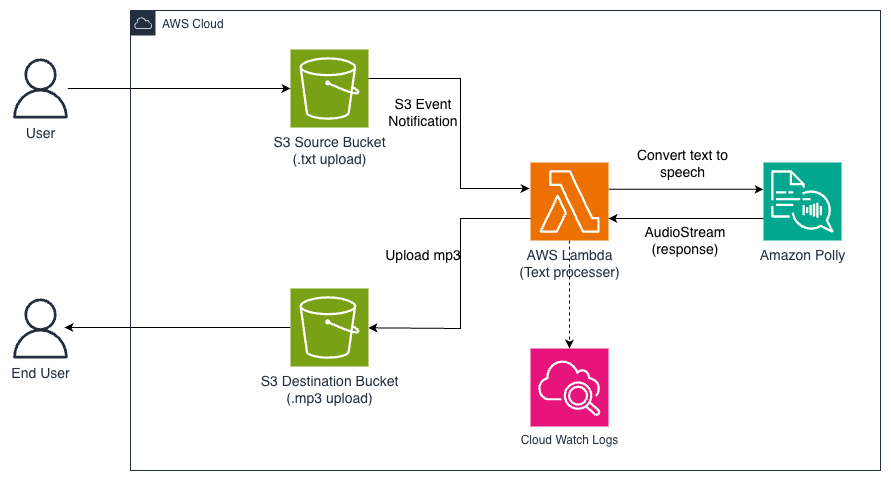

# Text to Speech Converter using Amazon Polly
Serverless Text-to-Speech Processing System on AWS

📌 Overview  
This project is a fully serverless text-to-speech conversion system built using AWS managed services. It allows users to upload text files to Amazon S3, automatically processes them with AWS Lambda, converts the text into speech using Amazon Polly, and stores the generated MP3 files in a destination S3 bucket — all without managing servers.

The project demonstrates serverless architecture, event-driven processing, AWS service integration, and cloud best practices for scalability, simplicity, and observability.

---

## 🎯 Problem Statement
Converting written content such as blog posts, notes, or book excerpts into audio usually requires manual tools or tightly coupled applications. These approaches can be:

- Time-consuming
- Hard to scale
- Difficult to automate
- Less flexible for cloud-based workflows

This project solves that problem by providing a cloud-native, serverless pipeline that automatically converts uploaded text files into audio files.

---

## 💡 Solution Summary
A user uploads a `.txt` file into a source S3 bucket.  
That upload triggers an AWS Lambda function via S3 Event Notification.  
The Lambda function reads the text file, sends the content to Amazon Polly, receives the generated audio stream, and uploads the resulting MP3 file into a destination S3 bucket.

This creates a simple, scalable, and fully managed text-to-speech conversion workflow.

---

## 🏗️ Architecture – AWS Services Used

- **Amazon S3** – Stores source text files and generated audio files
- **AWS Lambda** – Serverless processing logic
- **Amazon Polly** – Converts text into speech
- **Amazon CloudWatch** – Logging and monitoring
- **AWS IAM** – Secure role-based access between services

---

## 🔄 Processing Flow

1. User uploads a `.txt` file to the **S3 Source Bucket**
2. **S3 Event Notification** triggers the Lambda function
3. Lambda reads the uploaded text file from S3
4. Lambda sends the text to **Amazon Polly**
5. Amazon Polly converts the text to speech and returns an **AudioStream**
6. Lambda uploads the MP3 file to the **S3 Destination Bucket**
7. End user accesses the generated audio file

---

## 🖼️ Architecture Diagram



**Figure:** Serverless Text-to-Speech Architecture using Amazon S3, AWS Lambda, and Amazon Polly.

---

## ⚙️ Key Design Decisions

### Serverless-First Architecture
- No servers to provision or maintain
- Automatic scaling based on upload events
- Pay-per-use cost model

### Event-Driven Processing
- File upload in S3 automatically triggers processing
- No manual execution required
- Clean and efficient workflow for document-to-audio conversion

### Decoupled Storage Design
- Separate source and destination buckets
- Clear separation between input text and output audio
- Easier debugging and management

### Environment-Based Configuration
- Bucket names are stored as Lambda environment variables
- No hardcoded configuration in source code
- Easier to reuse across environments

### Observability
- Lambda execution flow is logged in CloudWatch
- Errors and processing stages are easier to trace
- Helps with debugging and reliability

---

## 🧪 How It Works

1. Open the source S3 bucket
2. Upload a `.txt` file
3. S3 automatically triggers the Lambda function
4. Lambda reads the file and sends the text to Amazon Polly
5. Polly generates speech and returns the audio stream
6. Lambda stores the generated `.mp3` file in the destination bucket
7. The final audio file is ready for download or playback

---

## 📘 Step-by-Step Setup Guide

### 1️⃣ Create IAM Role
Create a role for Lambda with the required permissions.

**Role Name**
```txt
PollyTranslationRole


